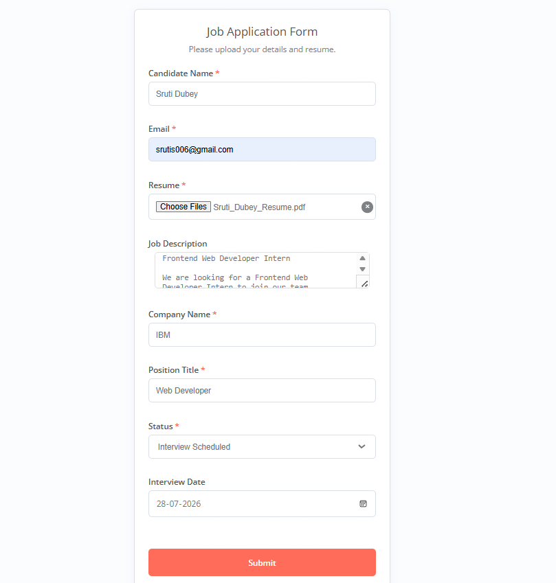
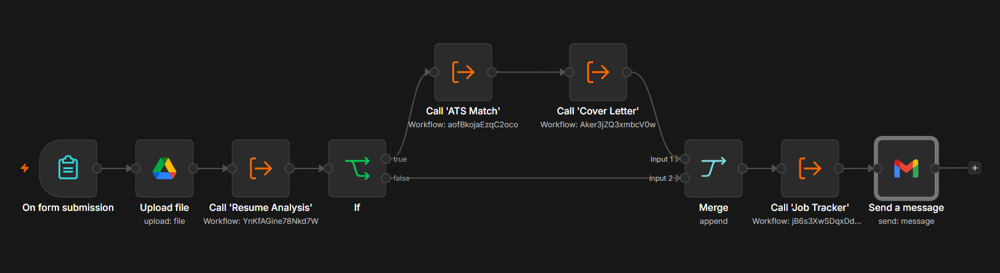
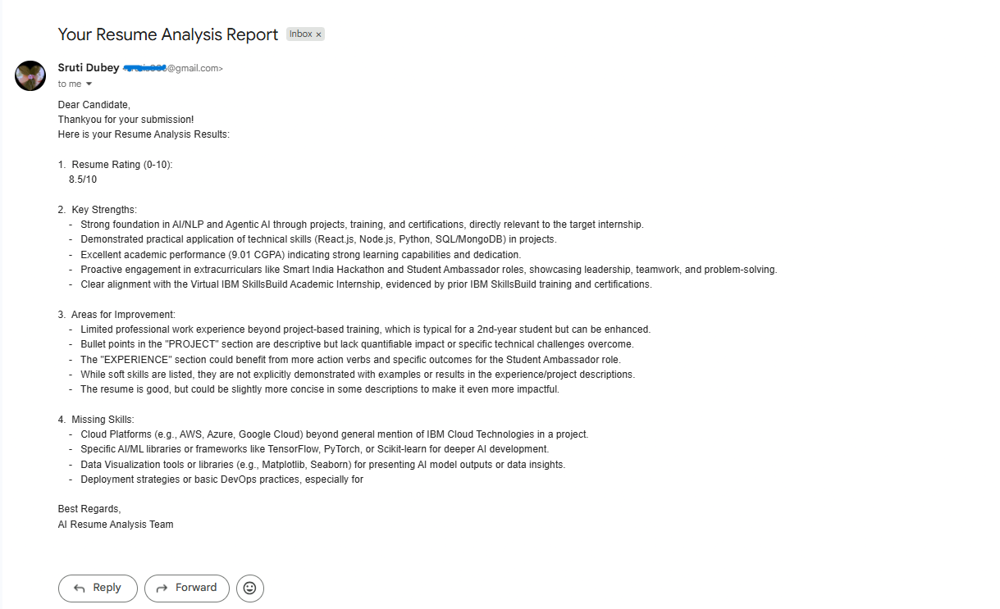
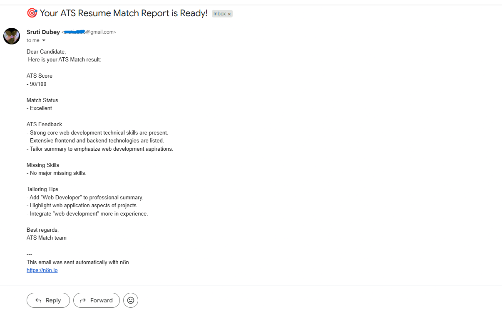
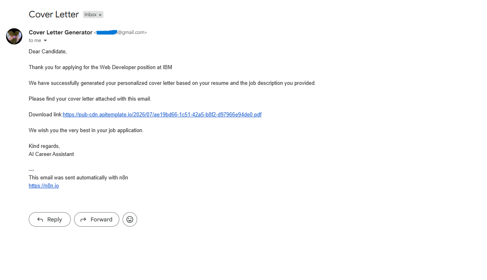
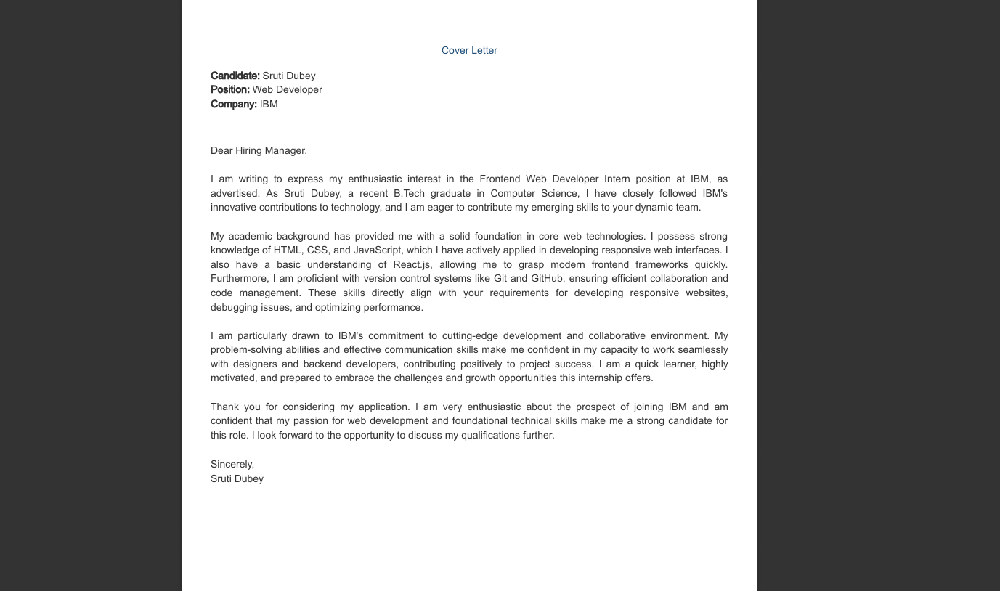
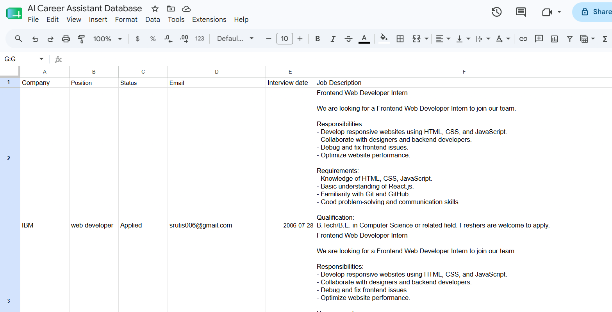
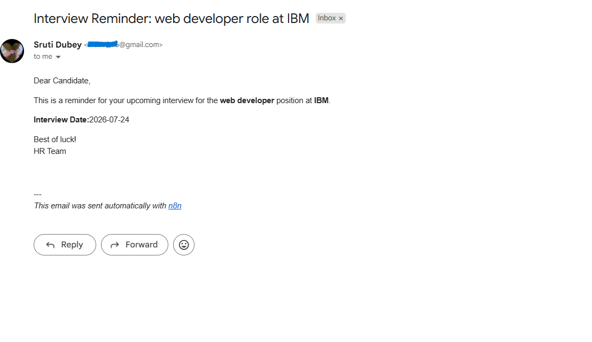
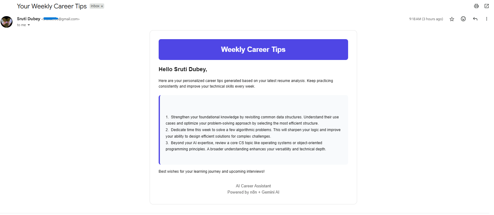
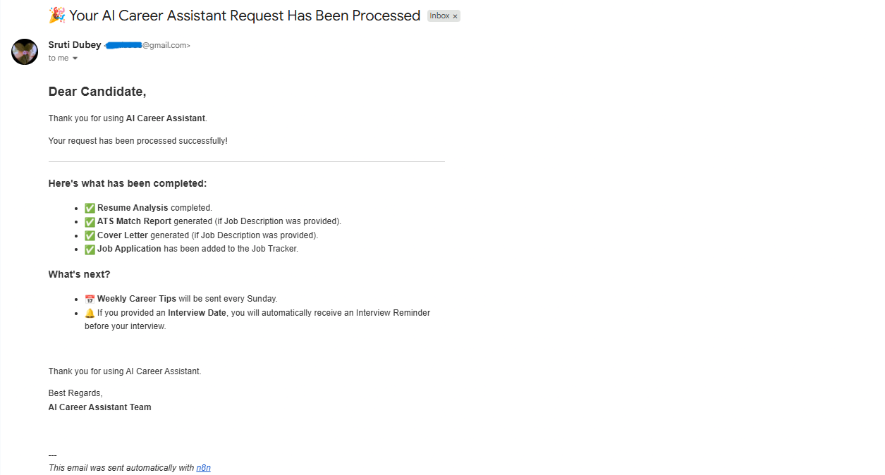

# 🤖 AI Career Assistant

> 🚀 An AI-powered workflow automation project built with **n8n** and **Google Gemini API** to simplify the job application process.

---

# 📌 Project Overview

AI Career Assistant is an end-to-end workflow automation project designed to simplify the job application process for students and job seekers.

The user submits a Google Form with their resume and job details. The workflow automatically analyzes the resume, evaluates ATS compatibility, generates a personalized cover letter, stores application details, schedules interview reminders, and sends weekly career improvement tips through email.

A confirmation email is also sent to the user, informing them about the services they received based on the information submitted in the form.
## 🌐 Live Demo

### 🚀 [Try the AI Career Assistant](https://sruti-1.app.n8n.cloud/form/ac244c89-bb45-48e6-a020-67142eeb8549)
---

# ✨ Key Features

- 📄 AI Resume Analysis
- 🎯 ATS Match Score & Feedback
- ✍️ AI-Generated Cover Letter
- 📊 Job Application Tracking using Google Sheets
- 📅 Automated Interview Reminder Emails
- 💡 Personalized Weekly Career Tips
- 📧 Automated Email Notifications
- ⚡ End-to-End Workflow Automation using n8n

---

# 🛠️ Technology Stack

- n8n
- Google Forms
- Google Sheets
- Gmail
- Google Gemini API
- HTML
- JavaScript
- Markdown

---

# ⚙️ Project Workflow

## 🔹 Step 1 — User Submission

The candidate fills out the Google Form with the following details:

- Candidate Name
- Email Address
- Resume
- Company Name
- Position Title
- Job Description (Optional)
- Application Status
- Interview Date

---

## 🔹 Step 2 — AI Resume Analysis

The uploaded resume is analyzed using Google Gemini AI to generate personalized insights and recommendations.

---

## 🔹 Step 3 — ATS Evaluation & Cover Letter Generation

If a Job Description is provided, the workflow:

- Calculates the ATS Match Score
- Generates ATS Feedback
- Identifies Missing Skills
- Creates a Personalized Cover Letter

---

## 🔹 Step 4 — Job Application Tracking

The candidate's application details are automatically stored in Google Sheets for easy tracking and management.

---

## 🔹 Step 5 — Interview Reminder Automation

If an interview date is available, the workflow automatically sends an interview reminder email one day before the scheduled interview.

---

## 🔹 Step 6 — Weekly Career Tips

The workflow generates personalized weekly career improvement tips based on the candidate's resume and automatically delivers them via email.

## 🔹 Step 7 — Confirmation Email

After completing all processes, the user receives a confirmation email summarizing the generated results including Resume Analysis, ATS Match Score, Cover Letter, and other career insights.

---

# 📂 Repository Structure

```
AI-Career-Assistant
│
├── README.md
├── workflows/
│   ├── 01-Resume-Analysis.json
│   ├── 02-ATS-Match.json
│   ├── 03-Cover-Letter.json
│   ├── 04-Interview-Reminder.json
│   ├── 05-Weekly-Career-Tips.json
│   ├── 06-Job-Tracker.json
│   └── 07-Final-Workflow.json
│
└── screenshots/
    ├── google-form.png
    ├── final-workflow.png
    ├── resume-analysis.png
    ├── ats-match.png
    ├── cover-letter.png
    ├── cover-letter-email.png
    ├── job-tracker.png
    ├── interview-reminder.png
    ├── weekly-career-tips.png
    └── confirmation-email.png
```

---

# 📸 Project Screenshots

## 📝 Google Form



---

## ⚙️ Final n8n Workflow



---

## 📄 Resume Analysis



---

## 🎯 ATS Match Result



---

## 📧 Cover Letter Email



---

## ✍️ AI Cover Letter



---

## 📊 Job Tracker (Google Sheets)



---

## 📅 Interview Reminder Email



---

## 💡 Weekly Career Tips Email



## 📧 Final Confirmation Email


---

# 🚀 How to Run

1. Clone this repository.
2. Import all workflow JSON files into n8n.
3. Configure Google Forms, Google Sheets, Gmail, and Google Gemini API credentials.
4. Activate the workflows.
5. Submit the Google Form.
6. The workflow will automatically process the request and generate the corresponding outputs.

---

# 📝 Notes

This project was developed and tested using free-tier cloud services and APIs.

During testing, temporary rate limits or server load may occasionally delay workflow execution or email delivery. In such cases, rerunning the workflow after a short interval typically resolves the issue.

The repository includes screenshots captured from successful workflow executions to demonstrate the expected outputs and overall functionality of the project.

---

# 👥 Project Team

This project was developed as part of the **IBM SkillsBuild Internship Program**.

| Role | Name | Contribution |
|------|------|--------------|
| **Project Developer** | **Sruti Dubey** | Designed and developed the AI Career Assistant, implemented n8n workflows, integrated AI services, and completed testing and documentation. |
| **Team Leader** | **Ishika Prasad** | Project coordination, Concept Note preparation, and support in project planning and execution. |
| **Team Member** | **Manshi Chowdhury** | Presentation (PPT) preparation and project presentation support. |
| **Team Member** | **Ishika Shaw** | Lean Canvas preparation and project documentation support. |

---

# 📄 License

This repository is shared for learning, demonstration, and academic purposes.

All project materials are intended to showcase workflow automation concepts and AI-powered application development.
